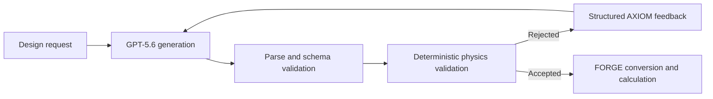

# FORGE - AXIOM Guard

FORGE is a neuro-symbolic engineering platform for battery-cell design. AXIOM lets a language model generate a
candidate specification, then places deterministic schema and physics validation between generation and
acceptance.

The OpenAI Build Week extension integrates GPT-5.6 through the OpenAI Responses API and demonstrates a complete
supervised correction: GPT-5.6 produces a schema-valid cylindrical-cell design that violates the coupled CY5
jelly-roll fit constraint, AXIOM returns exact corrective feedback, and a later GPT-5.6 attempt is accepted only
after every declared constraint passes.

> Generate freely. Validate deterministically. Accept only after the declared constraints pass.

## Demonstration

Open the **OpenAI Build Week** page in the Streamlit sidebar and select either mode:

- **Verified Replay** is the default and requires no API key. It loads the authentic, integrity-checked GPT-5.6
  failure-and-correction trace bundled with the repository.
- **Live OpenAI** sends the displayed synthetic design request to GPT-5.6 and runs at most two AXIOM attempts. It
  requires an `OPENAI_API_KEY` and may incur API charges.

Both modes show attempt progression, validator evidence, exact feedback, final engineering metrics, pipeline flow,
and a replayable Colored Petri Net. Verified Replay also exposes trace provenance and a downloadable audit bundle.



Passing the declared validator set does not establish complete physical correctness, manufacturability, safety, or
fitness for production.

## Quick Start

### Requirements

- Python 3.11 or newer
- Git
- A modern desktop browser
- Optional: an OpenAI API key for Live OpenAI mode

### Windows PowerShell

```powershell
git clone --branch build-week/openai --single-branch https://github.com/CmdrFALCO/FORGE.git
cd FORGE
py -3.11 -m venv .venv
.\.venv\Scripts\Activate.ps1
python -m pip install --upgrade pip
python -m pip install -e ".[gui,llm]"
python -m streamlit run forge/gui/app.py
```

### Linux or macOS

```bash
git clone --branch build-week/openai --single-branch https://github.com/CmdrFALCO/FORGE.git
cd FORGE
python3.11 -m venv .venv
source .venv/bin/activate
python -m pip install --upgrade pip
python -m pip install -e ".[gui,llm]"
python -m streamlit run forge/gui/app.py
```

Open the URL printed by Streamlit, normally `http://localhost:8501`, then choose **OpenAI Build Week** in the
sidebar. Verified Replay works immediately with bundled sample data and no external service.

## Optional Live OpenAI Mode

Set the API key only in the process that starts Streamlit. Do not place it in source code, committed files,
screenshots, or videos.

PowerShell:

```powershell
$secureKey = Read-Host "OpenAI API key" -AsSecureString
$env:OPENAI_API_KEY = [System.Net.NetworkCredential]::new("", $secureKey).Password
python -m streamlit run forge/gui/app.py
Remove-Item Env:OPENAI_API_KEY
```

Bash or Zsh:

```bash
read -rsp "OpenAI API key: " OPENAI_API_KEY && echo
export OPENAI_API_KEY
python -m streamlit run forge/gui/app.py
unset OPENAI_API_KEY
```

The Live page deliberately limits the scenario to two GPT-5.6 requests. Model output is retained only in the
browser session and is not written to the verified replay.

## Build Week Contribution Boundary

FORGE existed before OpenAI Build Week. The baseline is frozen at tag
[`build-week-baseline-2026-07-19`](https://github.com/CmdrFALCO/FORGE/tree/build-week-baseline-2026-07-19).

| Pre-existing FORGE capability | Added during OpenAI Build Week |
| --- | --- |
| Battery-cell schemas, calculators, conversion, and engineering constraints | OpenAI Responses API backend for GPT-5.6 |
| AXIOM generator-validator-supervisor and retry architecture | FastAPI routing for the canonical `openai` backend |
| Deterministic schema and physics validation | Bounded authentic-failure discovery and redacted trace promotion |
| Streamlit application and pipeline/CPN visualization components | Focused Verified Replay and Live OpenAI demonstration page |
| Claude, Ollama, and mock backends | Integrity-checked P4 CY5 replay and audit export |

The commit history after the baseline tag provides a dated, reviewable record of the Build Week extension.

## Authentic Replay Evidence

The canonical replay is stored in
[`data/demos/axiom/openai_build_week_cy5/`](data/demos/axiom/openai_build_week_cy5/):

- Attempt 1: authentic GPT-5.6 output, schema-valid, rejected only by CY5.
- AXIOM feedback: exact deterministic jelly-roll fit error returned to the model.
- Attempt 2: authentic GPT-5.6 correction, accepted by all declared constraints.
- Promotion: response identifiers removed; prompts, visible outputs, model telemetry, validation evidence, hashes,
  and timestamps preserved.

The replay adapter validates the trace, manifest, per-attempt content hashes, bundle hash, model telemetry, CY5
failure sequence, correction history, and final acceptance before rendering or exporting the audit ZIP.

See [OpenAI Build Week Demo and Provenance](docs/openai-build-week.md) for the detailed trace and testing path.

## Codex and GPT-5.6

Codex was used throughout the Build Week extension to inspect the existing architecture, define bounded phases,
implement the OpenAI backend and tests, build the failure-discovery and promotion tooling, create the demonstration
interface, diagnose UI behavior, and run verification. Human review retained control of product scope, engineering
semantics, live-request authorization, candidate selection, acceptance criteria, and every commit and push.

GPT-5.6 is the runtime generator being supervised. It produced the authentic candidate and correction preserved in
Verified Replay and powers the optional Live OpenAI path. GPT-5.6 does not decide whether a design is accepted; the
deterministic AXIOM validators remain authoritative.

## Testing

```bash
python -m pip install -e ".[dev,gui,llm,docs]"
python -m pytest --tb=short -q
python -m ruff check .
python -m mypy forge/
python -m mkdocs build --strict
```

Default tests are offline; tests marked `live` are deselected unless explicitly requested.

## Supported Platforms

- Runtime: Python 3.11+ and a modern browser
- Locally verified: Windows
- Automated project configuration: Ubuntu with Python 3.11
- macOS: expected to work through the standard Python setup above, but not independently verified

The Build Week demonstration does not require CAD, ML, or GPU dependencies.

## Documentation

- [Build Week demo and provenance](docs/openai-build-week.md)
- [Build Week product and implementation specification](docs/BUILD_WEEK_SPEC.md)
- [Build Week engineering log](docs/BUILD_WEEK_LOG.md)
- [AXIOM architecture](docs/axiom.md)
- [Development guide](docs/development.md)

## License

Licensed under the [MIT License](LICENSE). Copyright (c) 2026 Cristian Leu.
